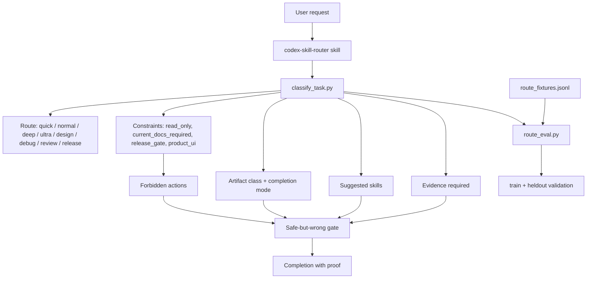
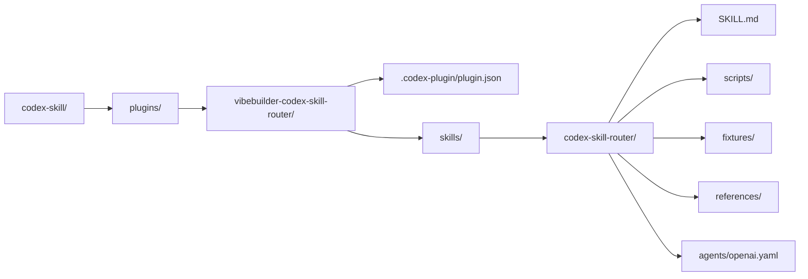
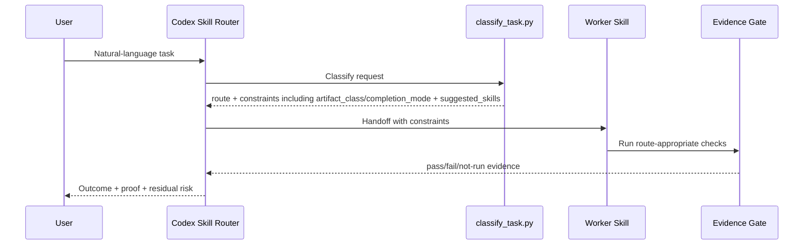

# Codex Skill

`codex-skill/` is a repo-local example for packaging a Codex skill and plugin around automatic task routing. It takes the `codex-extreme-operator` style workflow and turns it into a shareable Vibebuilder reference folder.

The goal is not to replace `vb-pack-codex-harness-v6`. This folder is smaller and more focused: it shows how to bundle a Codex plugin, one skill, route fixtures, route evals, and README-level diagrams.

## What This Folder Contains

| Path | Purpose |
| --- | --- |
| `plugins/vibebuilder-codex-skill-router/` | Codex plugin scaffold with `.codex-plugin/plugin.json` |
| `plugins/vibebuilder-codex-skill-router/skills/codex-skill-router/` | Installable skill folder |
| `scripts/classify_task.py` | Turns a request into route, constraints, artifact class, completion mode, skills, forbidden actions, and evidence |
| `fixtures/route_fixtures.jsonl` | Train and heldout examples for routing behavior |
| `scripts/route_eval.py` | Regression checker for route behavior |
| `scripts/self_test.py` | Local smoke test for scripts and route fixtures |
| `tests/test_codex_skill.py` | Repo-level structure and behavior test |

## Architecture



## Plugin Layout



## Routing Flow



## Example Classification

```bash
python3 plugins/vibebuilder-codex-skill-router/skills/codex-skill-router/scripts/classify_task.py \
  "수정하지 말고 현재 구조만 분석해줘"
```

Expected shape:

```json
{
  "route": "deep",
  "constraints": {
    "read_only": true,
    "current_docs_required": false,
    "artifact_class": "research_report",
    "completion_mode": "supporting_or_read_only"
  },
  "suggested_skills": ["evidence-loop"],
  "evidence_required": [
    "tests_or_contract_reasoning",
    "explicit_no_edit_confirmation",
    "source_citations_and_fact_inference_split",
    "artifact_scope_confirmation"
  ],
  "forbidden_actions": ["edit_files", "write_files", "stage_or_commit_changes"]
}
```

## Validation

Run the skill-level self-test:

```bash
python3 plugins/vibebuilder-codex-skill-router/skills/codex-skill-router/scripts/self_test.py
```

Run the repo-level test:

```bash
python3 -m unittest codex-skill/tests/test_codex_skill.py
```

The key safety property is that routing changes must pass both train and heldout fixtures before being treated as an improvement. Product-complete claims must also pass the artifact-class and safe-but-wrong checks so a generated checklist, doc, or handoff is not mislabeled as the requested runnable artifact.

## How To Extend

1. Add a failing or missing behavior to `fixtures/route_fixtures.jsonl`.
2. Run `scripts/route_eval.py` and confirm the fixture fails.
3. Update `scripts/classify_task.py`.
4. Run `scripts/self_test.py`.
5. Update this README if the route contract changes.
