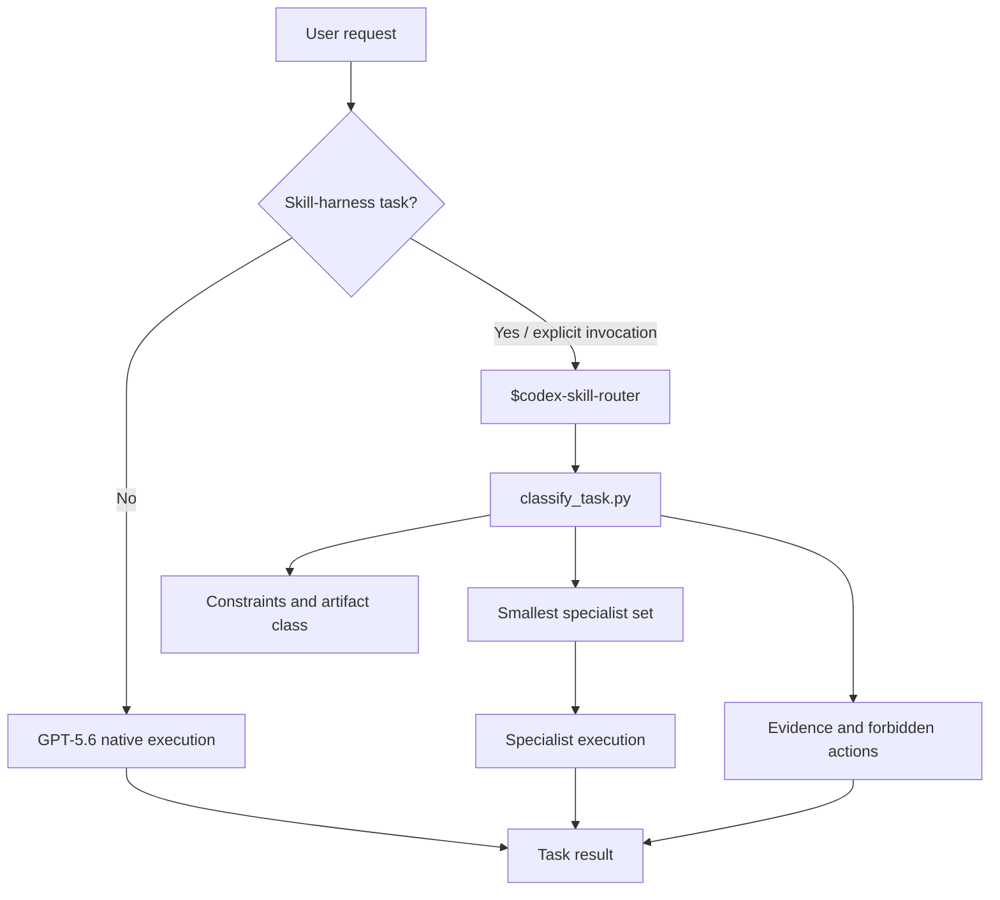
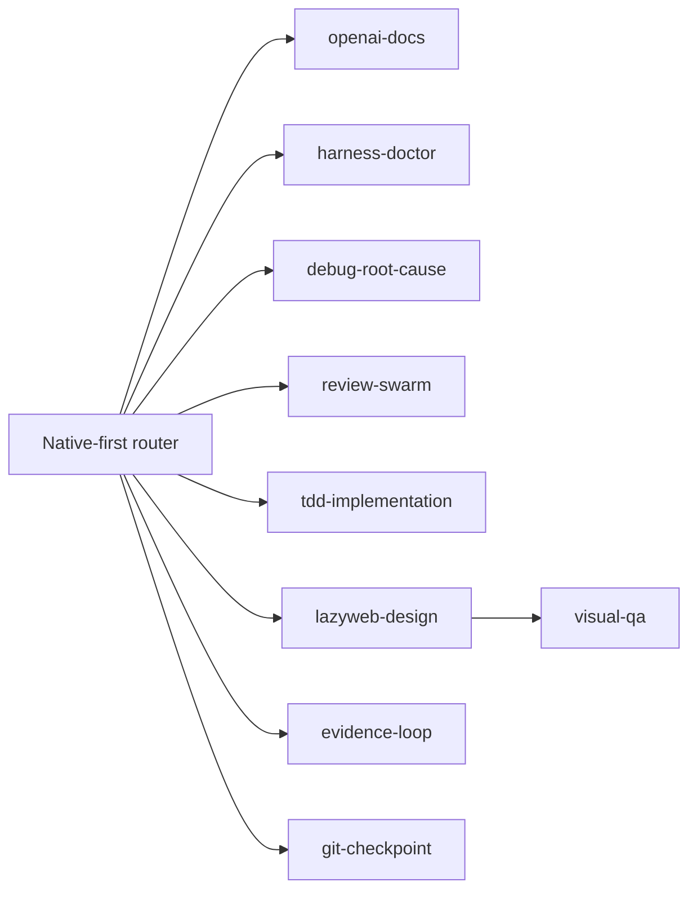

# GPT-5.6 Codex Skill Router

`codex-skill/`은 GPT-5.6에서 전역 스킬을 많이 쌓는 대신, 필요한 전문 스킬만 선택하도록 만든 repo-local 플러그인 예시다.

핵심 원칙은 `native-first`다.

- 작은 수정과 일반 구현은 GPT-5.6이 직접 처리한다.
- 범용 라우터를 모든 복잡한 작업 앞에 강제로 두지 않는다.
- OpenAI 문서, 디버깅, 리뷰, TDD, UI 검증처럼 실제 절차가 필요한 경우에만 전문 스킬을 사용한다.
- 전역 `AGENTS.md`는 짧게 유지하고, 프로젝트 규칙은 각 저장소 가까이에 둔다.
- skill router 자체는 암묵적으로 실행하지 않고 `$codex-skill-router`로 명시 호출한다.

이 방향은 OpenAI의 [GPT-5.6 가이드](https://developers.openai.com/api/docs/guides/latest-model)와 [Codex Skills 문서](https://developers.openai.com/codex/concepts/customization#skills)의 짧은 프롬프트·점진적 공개 원칙을 따른다.

## 포함된 구성

| 경로 | 역할 |
| --- | --- |
| `plugins/vibebuilder-codex-skill-router/` | Codex plugin manifest와 사용자 설명 |
| `skills/codex-skill-router/SKILL.md` | 명시적 GPT-5.6 skill-harness router |
| `scripts/classify_task.py` | native-first route·권한·skill·증거 계약 생성 |
| `scripts/install_global.py` | 백업 후 전역 AGENTS/config/skill 설치 |
| `fixtures/route_fixtures.jsonl` | train·held-out 회귀 사례 |
| `scripts/route_eval.py` | route뿐 아니라 skill 수·권한·effort까지 검증 |
| `scripts/self_test.py` | compile + train + held-out smoke test |
| `tests/test_codex_skill.py` | 패키지·설치기·라우팅 repo-level 테스트 |

## 구조



## 스킬 조합



| 작업 | 기본 조합 |
| --- | --- |
| 작은 편집·일반 구현 | 전문 스킬 없음 |
| GPT·OpenAI·Codex 최신 정보 | `openai-docs` |
| 스킬·라우팅 변경 | `harness-doctor` |
| 오류 원인 조사 | `debug-root-cause` |
| 출시·보안·명시적 감사 | `review-swarm` + 필요한 evidence |
| 동작을 가진 백엔드/API 구현 | `tdd-implementation` |
| 중요한 UI 방향 탐색 | `lazyweb-design`, 구현 후 `visual-qa` |
| 원격 게시 | `git-checkpoint`, 단 사용자 명시 요청이 있을 때만 |

## 예시

```bash
python3 plugins/vibebuilder-codex-skill-router/skills/codex-skill-router/scripts/classify_task.py \
  "gpt 5.6에서 기존 Codex 스킬 조합이 의미가 있는지 분석해줘"
```

이 요청은 `read_only=true`, `routing_policy=native-first`로 분류되고 `openai-docs`와 `harness-doctor`만 추천해야 한다. `tdd-implementation`과 `evidence-loop`는 붙지 않는다.

## 전역 설치

먼저 dry-run을 확인한다.

```bash
python3 plugins/vibebuilder-codex-skill-router/skills/codex-skill-router/scripts/install_global.py --dry-run
```

사용자가 전역 변경을 요청했다면 설치한다.

```bash
python3 plugins/vibebuilder-codex-skill-router/skills/codex-skill-router/scripts/install_global.py
```

설치기는 기존 전역 파일과 legacy router를 `~/.codex/backups/vibebuilder-codex-5-6/<timestamp>/`에 보존하고 active discovery에서 제외한다. 현재 App CLI와 충돌하는 오래된 hook/network config key도 함께 migration한다. 새 App 컨텍스트에서만 변경된 전역 지시와 skill 목록을 확인할 수 있다.

## 검증

```bash
python3 plugins/vibebuilder-codex-skill-router/skills/codex-skill-router/scripts/self_test.py
python3 -m unittest codex-skill/tests/test_codex_skill.py
```

현재 회귀 세트는 단순 route 일치만 확인하지 않는다. 분석의 read-only 기본값, 작은 편집의 0-skill 경로, OpenAI 공식 문서 선택, 원격 쓰기 권한, skill 수 상한을 함께 검사한다.
