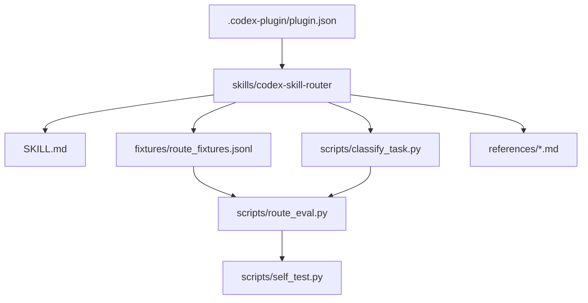

# Vibebuilder Codex Skill Router Plugin

This plugin packages a single Codex skill: `codex-skill-router`.

It is a reference implementation for Vibebuilder packs that want Codex to classify work before acting. The skill returns a route, constraints, suggested skill handoff, forbidden actions, and evidence requirements.

## Included Skill

```text
skills/codex-skill-router/
```

The skill includes:

- `SKILL.md`: trigger and workflow instructions.
- `scripts/classify_task.py`: deterministic first-pass route classifier.
- `scripts/route_eval.py`: route fixture regression test.
- `scripts/self_test.py`: local smoke test.
- `fixtures/route_fixtures.jsonl`: train and heldout cases.
- `references/`: readable contracts for adoption and routing.

## Installation Shape

The plugin manifest lives at:

```text
.codex-plugin/plugin.json
```

The manifest exposes:

```json
{
  "name": "vibebuilder-codex-skill-router",
  "skills": "./skills/"
}
```

This repo does not auto-install the plugin. It is a source package that can be copied or pointed to by a local Codex plugin workflow.

## Diagram



## Validate

From the repository root:

```bash
python3 /Users/isanginn/.codex/skills/.system/plugin-creator/scripts/validate_plugin.py \
  codex-skill/plugins/vibebuilder-codex-skill-router

python3 /Users/isanginn/.codex/skills/.system/skill-creator/scripts/quick_validate.py \
  codex-skill/plugins/vibebuilder-codex-skill-router/skills/codex-skill-router

python3 codex-skill/plugins/vibebuilder-codex-skill-router/skills/codex-skill-router/scripts/self_test.py
```
