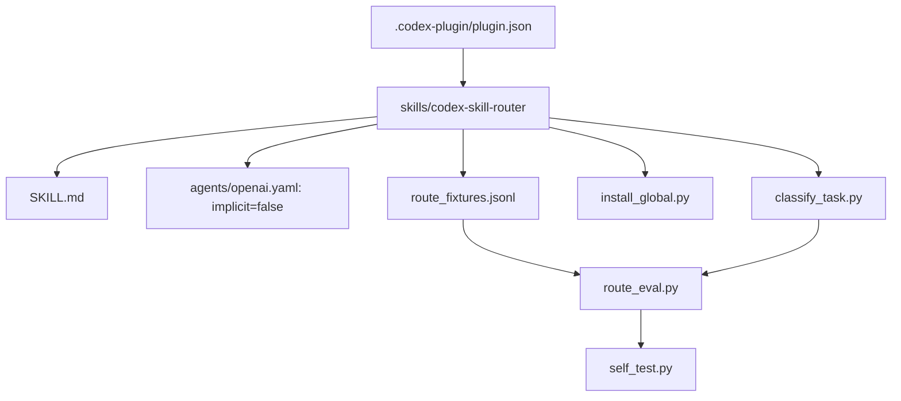

# Vibebuilder GPT-5.6 Codex Skill Router

이 플러그인은 모든 복잡한 작업을 범용 라우터로 감싸지 않는다. GPT-5.6이 일반 작업을 직접 처리하고, 사용자가 스킬·라우팅·전역 하네스를 다룰 때만 `$codex-skill-router`를 명시적으로 사용한다.

## v0.2.0에서 달라진 점

- router의 암묵적 호출을 비활성화했다.
- 답변·분석·리뷰·진단·계획은 구현 요청이 없으면 read-only로 본다.
- 작은 오타·문서 편집에는 TDD나 evidence stack을 붙이지 않는다.
- GPT/OpenAI/Codex 최신 정보에는 `openai-docs`를 직접 선택한다.
- UI는 큰 방향 탐색에만 Lazyweb을 사용하고, 작은 수정은 `visual-qa`만 사용한다.
- 원격 게시가 명시된 경우에만 `git-checkpoint`를 선택한다.
- 전역 설치기와 timestamp backup을 추가하고, legacy router를 active discovery 밖으로 archive한다.
- 현재 App CLI와 충돌하는 오래된 config key를 안전하게 migration한다.

## 플러그인 구조



## 전역 반영 범위

`install_global.py`는 사용자가 전역 변경을 명시했을 때만 실행한다.

- 설치: `~/.agents/skills/codex-skill-router`
- 개인 지시: `~/.codex/AGENTS.md`
- effort와 skill enablement: `~/.codex/config.toml`
- rollback backup: `~/.codex/backups/vibebuilder-codex-5-6/<timestamp>/`

새 라우터는 `allow_implicit_invocation=false`이므로 기본 prompt catalog에는 나타나지 않는다. `$codex-skill-router`로 명시 호출했을 때 설치본을 읽고 bundled classifier를 실행하는 것으로 반영을 검수한다.

## 검증

저장소 루트에서 실행한다.

```bash
python3 "$HOME/.codex/skills/.system/plugin-creator/scripts/validate_plugin.py" \
  codex-skill/plugins/vibebuilder-codex-skill-router

python3 "$HOME/.codex/skills/.system/skill-creator/scripts/quick_validate.py" \
  codex-skill/plugins/vibebuilder-codex-skill-router/skills/codex-skill-router

python3 codex-skill/plugins/vibebuilder-codex-skill-router/skills/codex-skill-router/scripts/self_test.py
python3 -m unittest codex-skill/tests/test_codex_skill.py
```
