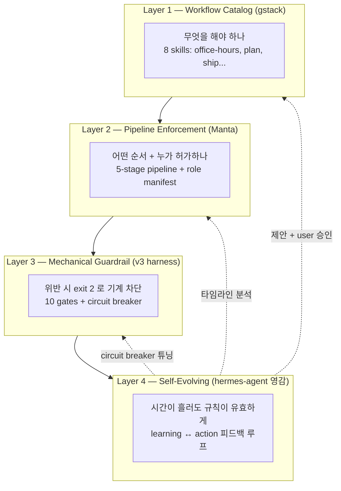
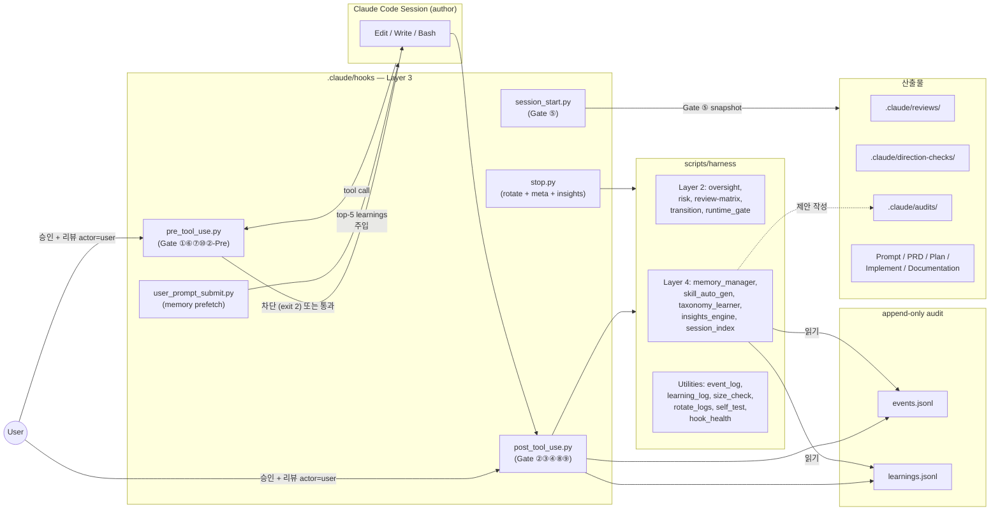
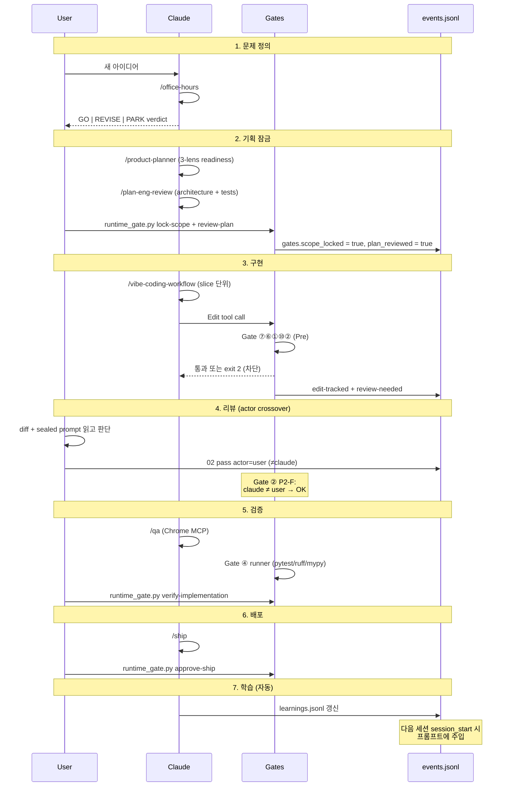
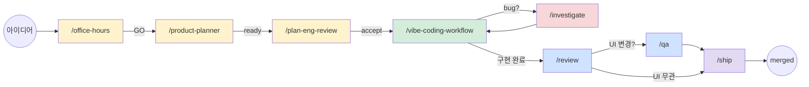
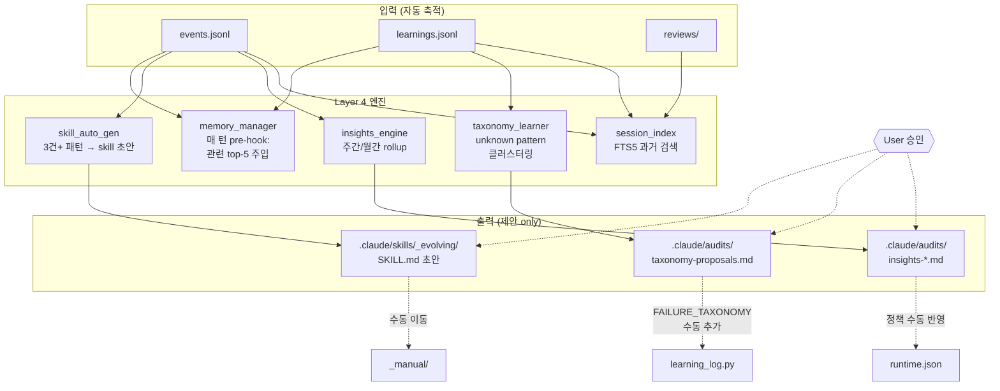
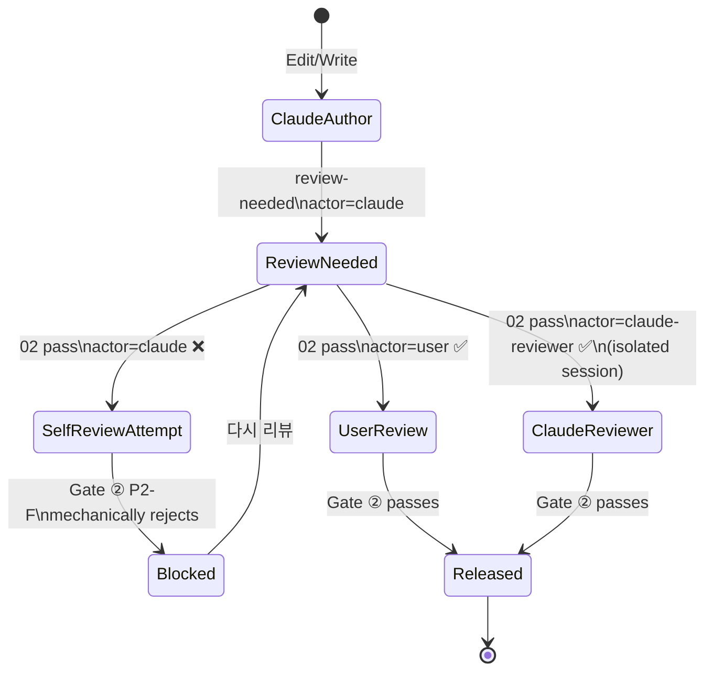
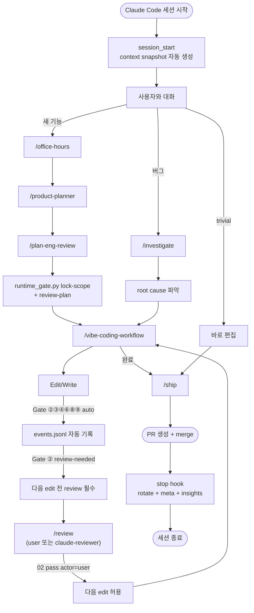

# vb-pack-claude-harness — 통합 설명서

**혼자 장기 프로젝트를 안정적으로 끌고 가기 위한 Claude 전용 하네스 프레임워크.**

`README.md` 가 설치와 첫 사용이라면, 이 문서는 **"왜 이 프레임워크가 이렇게 설계됐는가"** 를 설명한다. 한 번 읽으면 전체 그림이 잡힌다.

---

## 한 줄 요약

> **AI 가 틀린 방향으로 나갈 때 기계가 막아주고, 시간이 지나면서 프로젝트와 함께 스스로 적응하는 솔로 개발자용 하네스.**

---

## 1. 무엇을 푸는가 — 솔로 AI 코딩의 세 가지 함정

혼자 Claude Code 로 장기 프로젝트를 돌리면 **확실히** 다음이 일어난다:

| # | 함정 | 증상 |
|---|------|------|
| 1 | **확증 편향** | Claude 가 자기 판단을 끝까지 밀고 감. 한 번 틀린 가정이 1주일 간다 |
| 2 | **터널 비전** | 한 세션 안에서만 보이는 관점. 한 달 뒤 돌아오면 "왜 이렇게 만들었지?" |
| 3 | **장기 드리프트** | 규칙이 조용히 무너짐. 3개월 뒤 프레임워크/문서/코드가 제각각 |

일반 프롬프트 튜닝 (`CLAUDE.md` 에 규칙 나열) 으로는 **함정 3** 을 막지 못한다. AI 가 지시를 어기거나 규칙을 잊으면 감지 없이 drift.

**이 프레임워크의 답**: "AI 의 성실성에 의존하지 않고, 기계적으로 강제 + 시간이 지나면 스스로 진화."

---

## 2. 설계 원칙 — 4-축 (Four Axes)



각 Layer 는 **독립 책임** 을 가진다:

- **Layer 1** 이 "뭘 해야 할지" 모르면 Layer 2/3 가 아무리 강해도 빈 메커니즘
- **Layer 3** 이 약하면 Layer 1/2 의 가이드는 "잘 지키면 좋은 것" 에 그침
- **Layer 4** 가 없으면 Layer 1-3 이 6개월 안에 drift

---

## 3. 전체 구조도



---

## 4. 작업 흐름 (Lifecycle)



---

## 5. 10 Gates — 기계적 불변식

```mermaid
flowchart TD
    subgraph PRE["PreToolUse"]
        G7["Gate ⑦<br/>self-protect"]
        G10["Gate ⑩<br/>parallel spike<br/>(opt-in)"]
        G6["Gate ⑥<br/>scope check"]
        G1["Gate ①<br/>direction check"]
        G2P["Gate ②-Pre<br/>actor crossover +<br/>fingerprint + rollback +<br/>Gate ④ freshness"]
    end

    subgraph POST["PostToolUse"]
        G2R["Gate ②<br/>review-needed 기록"]
        G4["Gate ④<br/>deterministic tools<br/>(detached runner)"]
        G6T["Gate ⑥<br/>edit-tracked"]
        G8["Gate ⑧<br/>claim verification"]
        G9["Gate ⑨<br/>trust boundary"]
        G3["Gate ③<br/>learning record"]
    end

    subgraph SESS["SessionStart"]
        G5["Gate ⑤<br/>context snapshot<br/>+ memory prefetch"]
    end

    G7 --> G10 --> G6 --> G1 --> G2P
    G2R --> G4
    G4 --> G6T
    G6T --> G8
    G8 --> G9
    G9 --> G3
```



각 게이트의 **일관 규약**:
- 위반 시 `exit 2` + stderr 에 복구 지침
- 정상 시 append-only 이벤트 기록
- 3회 연속 실패 시 `hook_health.py` 가 circuit breaker 로 auto-disable

---

## 6. 8 Skills — 작업 흐름 카탈로그



**단계별 역할**:

| 단계 | Skill | 한 줄 설명 |
|------|-------|----------|
| 🎯 문제 정의 | `/office-hours` | 아이디어를 실제 사용자 문제로 reframe + go/no-go |
| 📋 기획 잠금 | `/product-planner` | Discovery / Product / Engineering 3-lens 로 readiness 판정 |
| 🏗️ 설계 잠금 | `/plan-eng-review` | architecture, data flow, edge cases, test plan 잠금 |
| 🔨 구현 | `/vibe-coding-workflow` | milestone slice + scope freeze + doc sync 규율 |
| 🔍 디버깅 | `/investigate` | proximate / root / systemic cause 3단 분리 |
| ✅ 코드 리뷰 | `/review` | 착륙 전 sealed-prompt 기반 적대 리뷰 (Gate ②) |
| 🌐 UI 검증 | `/qa` | 실제 브라우저 (MCP Chrome) 로 사용자 플로우 재현 |
| 🚀 배포 | `/ship` | 문서 sync + 테스트 green + PR open |

---

## 7. Self-Evolving 메커니즘 (Layer 4)



**핵심 원칙**: 모든 자가진화는 **제안**. 적용은 **user 명시 승인** 만. 프레임워크가 자기 규칙을 혼자 느슨하게 못 한다.

---

## 8. Actor Crossover 불변식 (핵심 철학)



- `claude` = 이 Claude Code 세션 (author)
- `user` = 본인, diff + sealed prompt 읽고 판단
- `claude-reviewer` = 별도 Claude Code 세션 (context 격리된 fresh eye)

**`claude == claude` 자기 리뷰 = 기계 차단**. 이것이 "mutual red-team" 철학의 솔로 환경 구현.

---

## 9. 디렉토리 레이아웃

```
vb-pack-claude-harness/
├── README.md                    ← 설치 + first-run + skill 카탈로그
├── OVERVIEW.md                  ← 이 문서 (왜 이렇게 설계됐나)
├── CLAUDE.md                    ← Claude 측 운영 헌법
├── AGENTS.md                    ← Secondary reviewer 규약 (축소본)
├── ETHOS.md                     ← 장기 내구성 철학
│
├── .claude/
│   ├── settings.local.json      ← Claude Code 훅 등록
│   ├── runtime.json             ← framework state (gates + limits + policy)
│   ├── known-gaps.md            ← 의도적 미흡 + trace 기준
│   │
│   ├── hooks/                   ← 7 Python hooks
│   │   ├── common.py              (공통 유틸)
│   │   ├── session_start.py       (Gate ⑤)
│   │   ├── user_prompt_submit.py  (Layer 4 prefetch)
│   │   ├── pre_tool_use.py        (Gate ①⑥⑦⑩②-Pre)
│   │   ├── post_tool_use.py       (Gate ②③④⑧⑨)
│   │   ├── stop.py                (rotate + meta + insights)
│   │   └── gate_4_runner.py       (deterministic tool runner, detached)
│   │
│   ├── agents/
│   │   ├── manifest.json        ← 9 roles × performed_by (solo v2.0)
│   │   └── review-matrix.json   ← 5 stages × required_reviewers
│   │
│   ├── sealed-prompts/          ← 13 immutable red-team prompts
│   │   (direction-check, review-code, review-plan, planner,
│   │    plan-redteam, implement-code, implement-tests,
│   │    tests-redteam, diff-redteam, risk-reviewer, verifier,
│   │    failure-analysis, meta-audit)
│   │
│   └── skills/
│       ├── _manual/             ← 8 curated skills
│       │   ├── office-hours/
│       │   ├── product-planner/
│       │   ├── plan-eng-review/
│       │   ├── vibe-coding-workflow/
│       │   ├── investigate/
│       │   ├── review/
│       │   ├── qa/
│       │   └── ship/
│       └── _evolving/           ← 자동 생성 영역
│           └── README.md
│
├── scripts/harness/             ← 19 Python modules
│   │  (Layer 2 policy)
│   ├── oversight_policy.py        retry budget / review freshness
│   ├── risk_policy.py             tier + risk reason derivation
│   ├── review_matrix_policy.py    stage → required reviewers
│   ├── transition_policy.py       stage → stage guard
│   ├── runtime_gate.py            CLI: flip gate flags
│   │  (Layer 3 core)
│   ├── event_log.py               append-only events + segmented rotation
│   ├── learning_log.py            FAILURE_TAXONOMY + append learning
│   ├── size_check.py              tier × complexity 분류
│   ├── bash_write_probe.py        Bash 우회 쓰기 탐지
│   ├── rotate_logs.py             5MB+ 시 segment rename
│   ├── hook_health.py             circuit breaker
│   ├── self_test.py               헬스체크
│   ├── meta_supervisor.py         T1-T6 트리거 평가
│   │  (Layer 4 self-evolving)
│   ├── memory_manager.py          pre-turn prefetch + post-turn sync
│   ├── skill_auto_gen.py          3건 패턴 → skill 초안
│   ├── taxonomy_learner.py        unknown pattern 클러스터링
│   ├── insights_engine.py         주간/월간 rollup
│   └── session_index.py           FTS5 과거 검색
│
├── templates/                   ← 6 Manta 필수 산출물 템플릿
│   ├── Prompt.md                  목표, 비목표, 제약, done-when
│   ├── PRD.md                     사용자 문제, AC, 리스크
│   ├── Plan.md                    milestone, 검증 계획, rollback
│   ├── Implement.md               현재 작업 범위, write paths
│   ├── Documentation.md           상태, 결정 로그, 재개 지점
│   └── Subagent-Manifest.md       역할 분담 (선택, 솔로에선 불필요)
│
└── tests/
    └── test_harness.py          ← 40 unit tests (전 영역 커버)
```

---

## 10. 기대 효과

### 단기 (1-4주)

| 효과 | 증거 (자동 측정) |
|------|-----------------|
| Scope creep 발생률 감소 | `events.jsonl` 의 `gate=06 outcome=block reason=scope-drift` 카운트 |
| 자기 리뷰 시도 차단 | Gate ② P2-F 로 `actor crossover` 강제. `events.jsonl` 에서 `02 block reason=prior review unrecorded` |
| Bash 우회 탐지 | `bash_write_probe` 가 tee/sed/printf/install 도 탐지 → `gate=06 actor=bash` |
| 테스트 없는 착륙 차단 | Gate ④ `outcome=block` 이면 다음 non-trivial edit 차단 (Gate ② Pre 통합) |

### 중기 (1-3개월)

| 효과 | 증거 |
|------|------|
| 반복 실수 패턴 가시화 | `learnings.jsonl` → Gate ⑤ snapshot → 다음 세션 context 자동 주입 |
| 실패 유형 taxonomy 성장 | `.claude/audits/taxonomy-proposals-*.md` 자동 생성 |
| 프로젝트 특화 skill 자동 제안 | `_evolving/` 에 3건 패턴 기반 skill 초안 |
| Tier 임계값 realistic 조정 | `insights_engine` 주간 rollup 이 실제 diff 분포 제안 |

### 장기 (6개월+)

| 효과 | 증거 |
|------|------|
| Drift 저항 | 6개월 전 세션과 오늘 세션이 **같은 규칙** 으로 움직임 |
| 프로젝트 프로필 축적 | `.claude/memory/project-profile.md` 가 이 프로젝트만의 패턴 반영 |
| 이주 가능성 | `runtime.json → framework_version` + migration script 로 v1→v2 안전 이주 |

---

## 11. 참고 레퍼런스

이 프레임워크는 네 가지 선행 작업에서 각자 **다른 문제** 를 빌려왔다:

| 레퍼런스 | 링크 | 빌린 것 |
|---------|------|---------|
| **gstack** | [garrytan/gstack](https://github.com/garrytan/gstack) | 20+ skills 중 솔로에 맞는 8개 패턴 (SKILL.md 형식, 작업 단계별 카탈로그) |
| **Manta** | (개인 프레임워크) | 5-stage pipeline, role manifest, 필수 산출물 6개, Python hooks 패턴 |
| **v3 (Claude↔Codex)** | (이 프레임워크의 전신) | 10 gates mechanical enforcement, actor crossover, append-only, FAILURE_TAXONOMY |
| **hermes-agent** | [NousResearch/hermes-agent](https://github.com/NousResearch/hermes-agent) | self-improving learning loop, autonomous skill creation, insights engine |

네 레퍼런스는 **다른 층위** 에서 각자 잘 하는 일이 있다. 하나만 써서는 어느 층이든 비어있고, 네 개를 합쳐야 **"무너지지 않는 솔로 프레임워크"** 가 된다.

---

## 12. 사용 설명서

### 설치 (복제)

```bash
# 1. 새 프로젝트 루트에서
cp -r /path/to/vb-pack-claude-harness/.claude /your/project/
cp -r /path/to/vb-pack-claude-harness/scripts /your/project/
cp -r /path/to/vb-pack-claude-harness/templates /your/project/
cp /path/to/vb-pack-claude-harness/{CLAUDE,AGENTS,ETHOS,README}.md /your/project/

# 2. 실행 권한
chmod +x /your/project/.claude/hooks/*.py
chmod +x /your/project/scripts/harness/*.py

# 3. 필수 산출물 초기화
cp /your/project/templates/{Prompt,PRD,Plan,Implement,Documentation}.md \
   /your/project/

# 4. 헬스체크
cd /your/project
python3 scripts/harness/self_test.py
python3 -m unittest discover -s tests -v
```

**기대 출력**:
- `All 5 hooks + 18 harness scripts + 4 docs + 5 core files + 13 sealed prompts verified. Harness is live.`
- `Ran 40 tests — OK`

### 일상 사용 흐름



### First-run 시 알아둘 것

| 시나리오 | 행동 |
|---------|------|
| 첫 `normal` tier edit | Gate ① block — direction-check 먼저 |
| 첫 Gate ② review-needed | user 가 `.claude/reviews/<ts>.md` 작성 후 `02 pass user` |
| 훅이 뭔가 이상하다 | `python3 scripts/harness/hook_health.py status` |
| 훅이 망가져서 disable 됨 | `python3 scripts/harness/hook_health.py reset <hook-name>` |
| events.jsonl 이 5MB 넘음 | stop hook 이 자동 rotate (segment rename) |

### 장기 운영 팁

- **1주차**: 작은 작업으로 Gate ① ~ Ship 흐름 한 번 완주. 어디서 막히는지 체감
- **1개월차**: `insights_engine.py --force` 로 첫 rollup. 실제 사용 패턴 확인
- **3개월차**: `_evolving/` 의 자동 제안 skill 검토. 채택 or reject 결정
- **6개월차**: `taxonomy-proposals.md` 가 쌓였다면 FAILURE_TAXONOMY 확장 (user 승인 후 `learning_log.py` 편집)

---

## 13. 판정 근거 (장기 내구성)

솔로 + 장기 사용 기준으로 **GO** 를 뒷받침하는 검증:

| 항목 | 결과 |
|------|------|
| Self-test 자동화 | ✅ 5 hooks + 18 scripts + 4 docs + 5 core + 13 sealed 일괄 검증 |
| Unit tests | ✅ 40/40 PASS (0.08s) |
| E2E actor crossover | ✅ 6/6 PASS (claude→user 교차, self-review 차단, claude-reviewer 교차) |
| rotate_logs 스트레스 | ✅ 5MB+ → segment rename → 60,100 events 무결 |
| Circuit breaker | ✅ 5/5 hooks 통합, 3회 실패 시 auto-disable |
| memory prefetch 통합 | ✅ user_prompt_submit 에서 top-5 learnings 주입 확인 |
| 문서-구현 drift | ✅ sealed-prompts 13개 모두 솔로 모델 반영 |
| 자가진화 안전 장치 | ✅ 모든 Layer 4 결과는 제안 only, user 승인 경유 |

---

## 14. 한 줄 결론

> **"AI 가 삐뚤어질 때 기계가 막고, 시간이 지나도 함께 적응하고, 나(사용자) 가 주도권을 유지한다."**

이게 되면 혼자 1년 프로젝트를 끌고 가도 한 달 전의 나와 지금의 나가 **같은 규칙으로** 움직인다. 그게 이 하네스가 푸는 실제 문제다.

---

## License

MIT (상위 Vibebuilder 레포 라이선스 따름)
